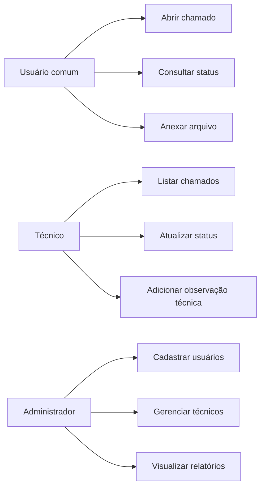
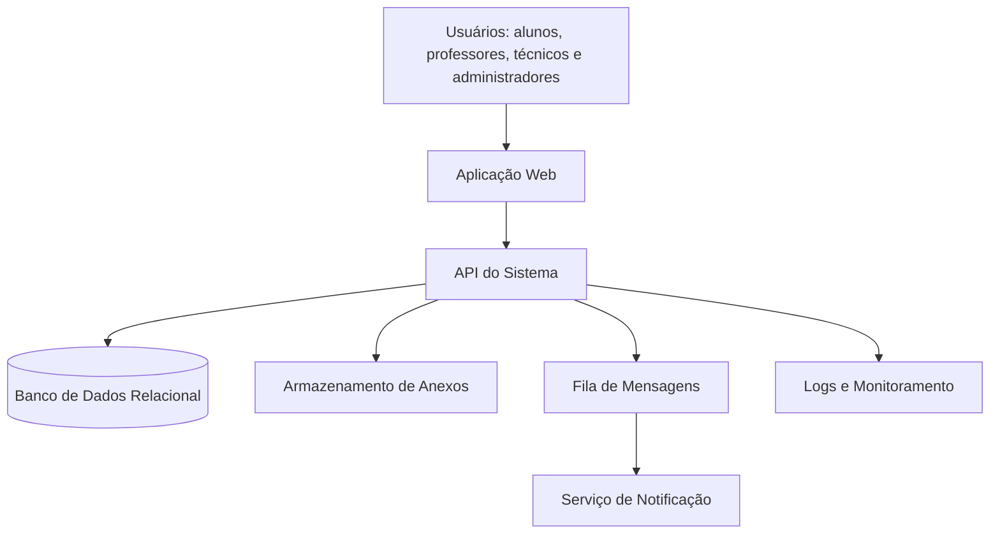
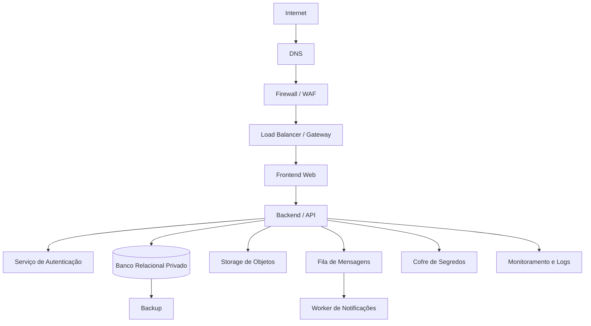
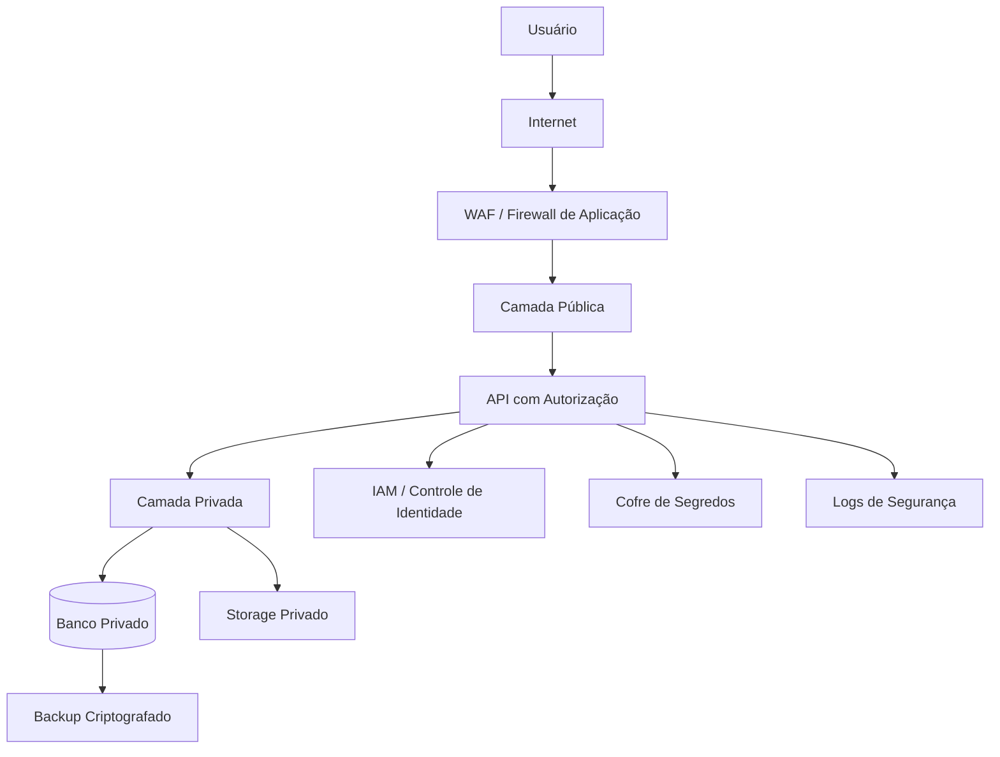
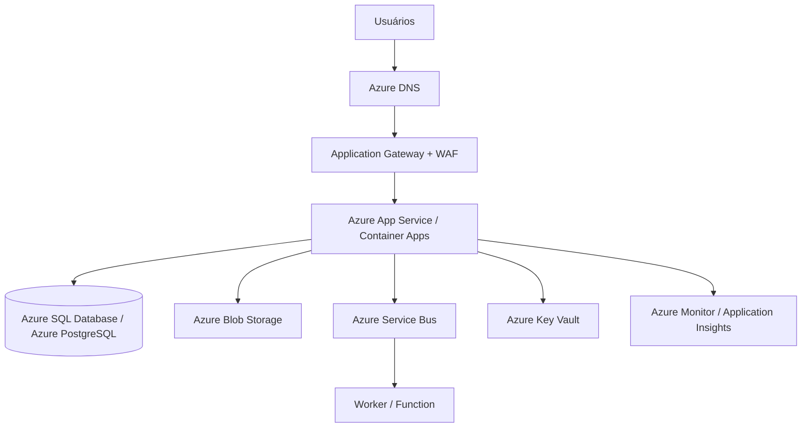
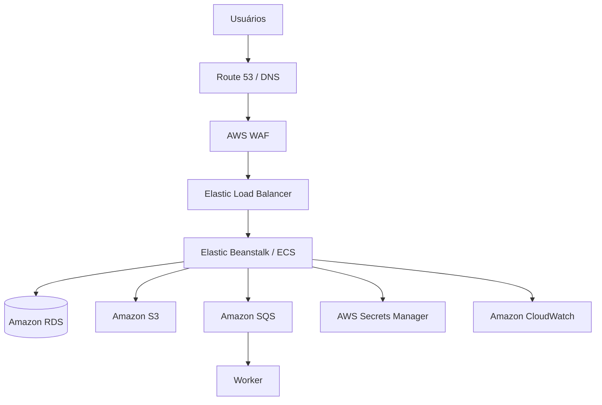
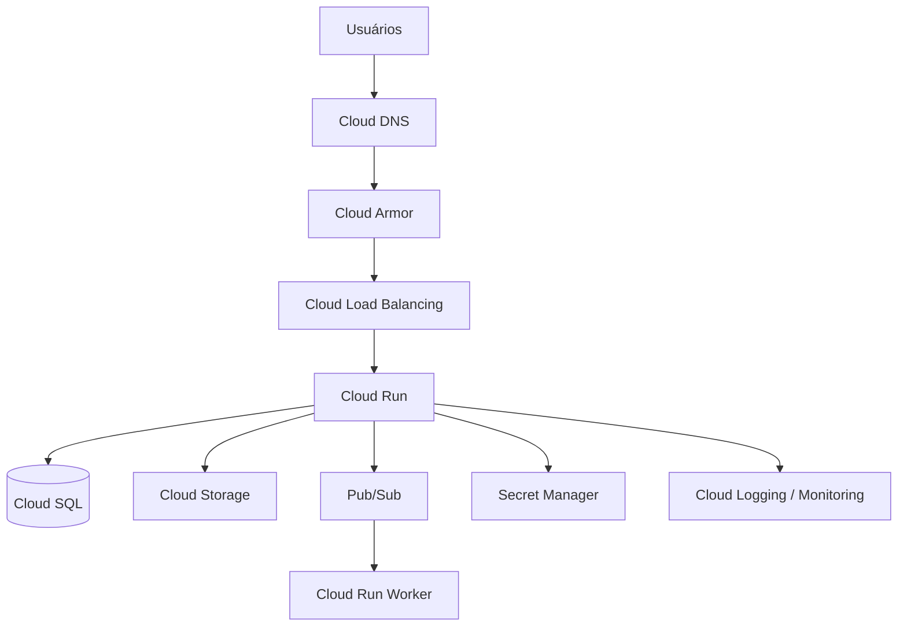
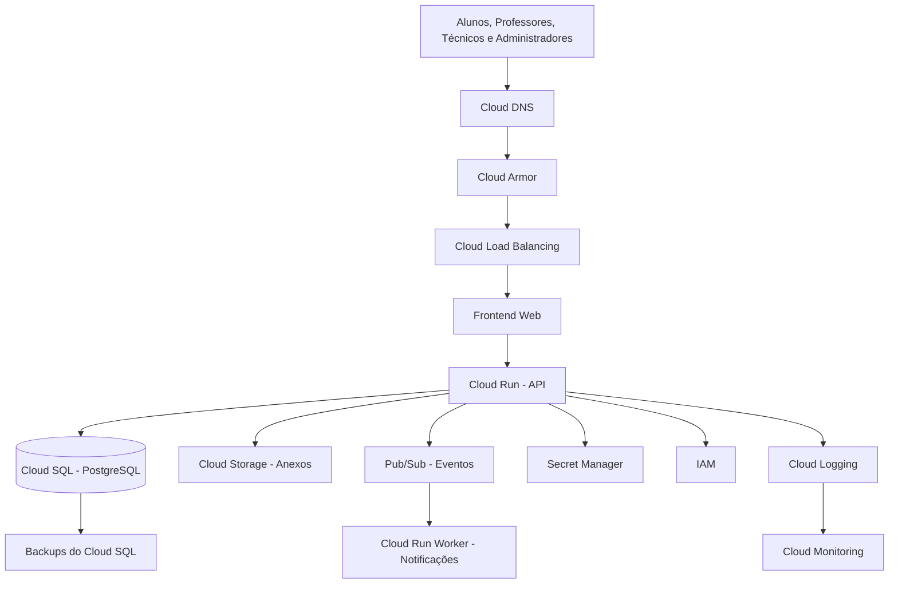
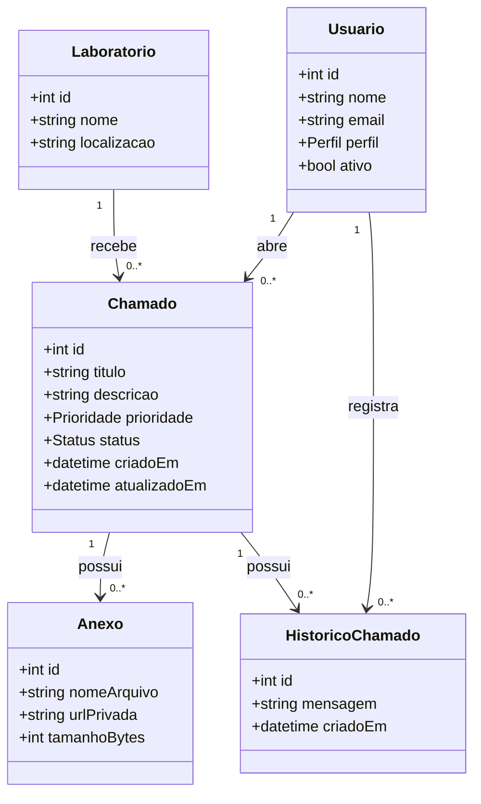
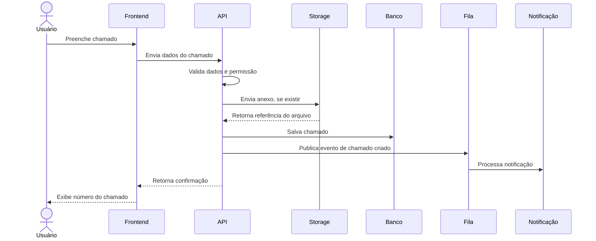

# Solução Modelo — Trabalho Prático de Computação em Nuvem

**Título do projeto:** Cloud Architecture Challenge — Sistema de Chamados Acadêmicos  
**Foco da prática:** desenho, construção arquitetural, justificativa técnica, segurança e comparação entre provedores.  
**Nível sugerido:** graduação / disciplina de Computação em Nuvem.  
**Código:** opcional e demonstrativo, não é o centro da avaliação.

---

## 1. Visão geral da prática

Este documento apresenta uma **solução modelo completa** para um trabalho prático de Computação em Nuvem sem necessidade de acesso real à AWS, Azure ou Google Cloud.

A proposta é que os alunos atuem como uma equipe de arquitetura/consultoria contratada por uma instituição de ensino para projetar uma solução em nuvem para um **Sistema de Chamados Acadêmicos**.

O objetivo principal não é programar o sistema completo. O objetivo é demonstrar capacidade de:

- entender fundamentos de computação em nuvem;
- levantar requisitos;
- desenhar uma arquitetura coerente;
- justificar decisões técnicas;
- aplicar princípios de segurança;
- comparar serviços equivalentes em Azure, AWS e Google Cloud;
- defender uma solução final.

---

## 2. Cenário do problema

Uma faculdade possui laboratórios de informática usados por alunos e professores. Atualmente, os problemas técnicos são comunicados por mensagens informais, e-mails ou conversas presenciais.

Isso gera vários problemas:

- chamados se perdem;
- não há histórico de atendimento;
- não há prioridade clara;
- técnicos não têm painel centralizado;
- professores não conseguem acompanhar o andamento;
- administradores não possuem relatórios;
- anexos, como prints de erro, ficam espalhados;
- não há registro organizado de incidentes.

A instituição deseja um sistema online para gerenciar chamados técnicos dos laboratórios.

---

## 3. Objetivo da solução

Projetar uma arquitetura em nuvem para um sistema capaz de:

- permitir abertura de chamados;
- permitir acompanhamento do status;
- permitir anexos;
- permitir autenticação de usuários;
- permitir diferentes perfis de acesso;
- armazenar dados com segurança;
- registrar logs;
- permitir notificações;
- permitir crescimento futuro para outras unidades da instituição.

---

## 4. Escopo da solução

### 4.1 Está dentro do escopo

- Desenho da arquitetura.
- Requisitos funcionais e não funcionais.
- Modelo conceitual do sistema.
- Diagrama lógico da solução.
- Diagrama de segurança.
- Mapeamento para Azure.
- Mapeamento para AWS.
- Mapeamento para Google Cloud.
- Matriz de decisão.
- Registro de decisões arquiteturais.
- Análise de riscos.
- Protótipo textual ou conceitual em Python/C++.

### 4.2 Está fora do escopo

- Implantação real em provedores de nuvem.
- Criação de conta em AWS, Azure ou Google Cloud.
- Desenvolvimento completo de frontend.
- Pagamento de serviços.
- Integração real com e-mail/SMS.
- Sistema real de produção.

---

## 5. Relação com os temas da disciplina

| Tema | Como aparece na prática |
| --- | --- |
| Tema 2 — Fundamentos de Computação em Nuvem | Uso de serviços sob demanda, escalabilidade, disponibilidade, modelo de responsabilidade compartilhada e arquitetura orientada a serviços. |
| Tema 3 — Arquitetura de Computação em Nuvem | Separação em camadas, frontend, backend, banco, storage, fila, autenticação, logs e monitoramento. |
| Tema 4 — Segurança em Computação em Nuvem | IAM, controle de acesso, cofre de segredos, banco privado, logs, criptografia, princípio do menor privilégio e análise de riscos. |
| Tema 5 — Azure | Mapeamento da arquitetura para serviços do Azure. |
| Tema 6 — AWS | Mapeamento da arquitetura para serviços da AWS. |
| Tema 7 — Google Cloud | Mapeamento da arquitetura para serviços do Google Cloud. |

---

## 6. Requisitos funcionais

| Código | Requisito funcional |
| --- | --- |
| RF01 | O usuário deve conseguir abrir um chamado técnico. |
| RF02 | O usuário deve informar título, descrição, laboratório, categoria e prioridade do chamado. |
| RF03 | O usuário deve poder anexar uma imagem ou documento ao chamado. |
| RF04 | O técnico deve visualizar chamados pendentes. |
| RF05 | O técnico deve alterar o status do chamado. |
| RF06 | O administrador deve cadastrar usuários e técnicos. |
| RF07 | O sistema deve diferenciar perfis de usuário: aluno/professor, técnico e administrador. |
| RF08 | O usuário deve acompanhar o histórico do chamado. |
| RF09 | O sistema deve registrar data e hora de abertura e atualização. |
| RF10 | O sistema deve enviar notificação quando o status for alterado. |
| RF11 | O administrador deve visualizar relatórios básicos de chamados por status, laboratório e prioridade. |

---

## 7. Requisitos não funcionais

| Código | Requisito não funcional |
| --- | --- |
| RNF01 | A solução deve possuir autenticação de usuários. |
| RNF02 | A solução deve possuir autorização baseada em perfil. |
| RNF03 | As senhas não devem ser armazenadas em texto puro. |
| RNF04 | O banco de dados não deve ficar exposto diretamente à internet. |
| RNF05 | Arquivos anexados devem ser armazenados em serviço próprio de objetos/storage. |
| RNF06 | Segredos, chaves e senhas devem ser guardados em cofre de segredos. |
| RNF07 | O sistema deve registrar logs de acesso e erro. |
| RNF08 | A solução deve prever backup do banco de dados. |
| RNF09 | A solução deve permitir escalabilidade horizontal da aplicação. |
| RNF10 | A solução deve ser desenhada para facilitar manutenção e evolução. |
| RNF11 | A solução deve considerar disponibilidade e tolerância a falhas. |
| RNF12 | O acesso aos serviços deve seguir o princípio do menor privilégio. |

---

## 8. Atores do sistema

| Ator | Descrição |
| --- | --- |
| Usuário comum | Aluno ou professor que abre e acompanha chamados. |
| Técnico | Profissional responsável por atender e atualizar chamados. |
| Administrador | Pessoa responsável por gerenciar usuários, técnicos e relatórios. |
| Sistema de notificação | Componente responsável por avisar usuários sobre mudanças de status. |
| Serviço de armazenamento | Componente responsável por guardar anexos. |
| Serviço de monitoramento | Componente responsável por coletar logs e métricas. |

---

## 9. Casos de uso principais

---

## 10. Arquitetura conceitual

A arquitetura conceitual mostra os grandes blocos da solução, sem ainda citar provedores específicos.

### Justificativa

A solução foi dividida em componentes para facilitar manutenção, segurança e escalabilidade.

- A aplicação web é a interface usada pelos usuários.
- A API concentra as regras de negócio.
- O banco relacional armazena usuários, chamados e histórico.
- O storage guarda arquivos anexados.
- A fila desacopla o envio de notificações.
- O serviço de logs permite diagnóstico, auditoria e monitoramento.

---

## 11. Arquitetura lógica

A arquitetura lógica detalha melhor os componentes e as responsabilidades.

---

## 12. Justificativa dos componentes

| Componente | Justificativa |
| --- | --- |
| DNS | Facilita o acesso ao sistema por nome, como `chamados.faculdade.edu.br`. |
| WAF | Protege contra ameaças comuns em aplicações web, como tentativas de exploração automatizadas. |
| Load Balancer / Gateway | Distribui tráfego e permite escalar múltiplas instâncias da aplicação. |
| Frontend Web | Interface usada por alunos, professores, técnicos e administradores. |
| Backend/API | Centraliza regras de negócio, autenticação, autorização e comunicação com os serviços. |
| Banco Relacional | Adequado para dados estruturados: usuários, chamados, status, histórico e permissões. |
| Storage de Objetos | Mais adequado para anexos do que salvar arquivos diretamente no banco. |
| Fila de Mensagens | Evita que o usuário tenha que esperar o envio de notificações. |
| Worker | Processa tarefas em segundo plano, como notificações. |
| Cofre de Segredos | Guarda senhas, tokens, chaves e strings de conexão com segurança. |
| Logs e Monitoramento | Permitem acompanhar erros, uso, desempenho e eventos de segurança. |
| Backup | Reduz risco de perda de dados. |

---

## 13. Arquitetura de segurança

### Decisões de segurança

| Item | Decisão |
| --- | --- |
| Autenticação | Todos os usuários devem se autenticar. |
| Autorização | Cada perfil acessa apenas o que precisa. |
| Banco de dados | Deve ficar em rede privada, sem acesso direto pela internet. |
| Storage | Anexos devem ser privados; acesso deve ocorrer via aplicação. |
| Segredos | Senhas e chaves ficam em cofre de segredos, não no código. |
| Logs | Devem registrar eventos relevantes, sem armazenar senhas ou tokens. |
| Backup | Deve ser periódico e protegido. |
| Privilégios | Aplicar princípio do menor privilégio. |

---

## 14. Modelo de responsabilidade compartilhada

Em computação em nuvem, segurança é uma responsabilidade compartilhada entre provedor e cliente.

| Responsabilidade | Provedor de nuvem | Cliente/equipe |
| --- | --- | --- |
| Segurança física dos datacenters | Sim | Não |
| Infraestrutura base | Sim | Não |
| Disponibilidade dos serviços gerenciados | Sim | Parcial |
| Configuração de permissões | Parcial | Sim |
| Proteção de contas e senhas | Parcial | Sim |
| Classificação dos dados | Não | Sim |
| Regras de acesso da aplicação | Não | Sim |
| Código seguro | Não | Sim |
| Backup configurado corretamente | Parcial | Sim |
| Monitoramento da aplicação | Parcial | Sim |

---

## 15. Mapeamento para Azure

| Necessidade da solução | Serviço possível no Azure | Justificativa |
| --- | --- | --- |
| Hospedar frontend/API | Azure App Service ou Azure Container Apps | Permitem hospedar aplicações web e APIs com menor necessidade de gerenciar servidores diretamente. |
| Banco relacional | Azure SQL Database ou Azure Database for PostgreSQL | Serviços gerenciados para dados relacionais. |
| Armazenar anexos | Azure Blob Storage | Serviço adequado para armazenamento de objetos e arquivos. |
| Segredos | Azure Key Vault | Armazena chaves, senhas, certificados e outros segredos. |
| Identidade | Microsoft Entra ID / Azure RBAC | Controle de identidade e permissões. |
| Fila | Azure Service Bus ou Azure Queue Storage | Permite comunicação assíncrona. |
| Monitoramento | Azure Monitor / Application Insights | Coleta métricas, logs e telemetria da aplicação. |
| Proteção de entrada | Azure Application Gateway com WAF | Proteção e roteamento de tráfego HTTP/HTTPS. |
| Backup | Backup nativo do banco/Storage | Reduz risco de perda de dados. |

### Desenho da solução no Azure

---

## 16. Mapeamento para AWS

| Necessidade da solução | Serviço possível na AWS | Justificativa |
| --- | --- | --- |
| Hospedar frontend/API | Elastic Beanstalk, ECS ou EC2 | Permite hospedar aplicações web; Elastic Beanstalk automatiza parte do provisionamento. |
| Banco relacional | Amazon RDS | Serviço gerenciado para bancos relacionais. |
| Armazenar anexos | Amazon S3 | Serviço de armazenamento de objetos muito usado para arquivos. |
| Segredos | AWS Secrets Manager / Systems Manager Parameter Store | Guarda e fornece segredos para aplicações. |
| Identidade | AWS IAM | Controle de permissões e acesso a recursos. |
| Fila | Amazon SQS | Serviço de fila gerenciada. |
| Monitoramento | Amazon CloudWatch | Coleta métricas, logs e alarmes. |
| Proteção de entrada | AWS WAF + Elastic Load Balancer | Protege e distribui o tráfego. |
| Backup | Backups automáticos no RDS / políticas de retenção | Reduz risco de perda de dados. |

### Desenho da solução na AWS

---

## 17. Mapeamento para Google Cloud

| Necessidade da solução | Serviço possível no Google Cloud | Justificativa |
| --- | --- | --- |
| Hospedar frontend/API | Cloud Run ou Compute Engine | Cloud Run é adequado para aplicações conteinerizadas e gerenciadas. |
| Banco relacional | Cloud SQL | Serviço gerenciado para banco relacional. |
| Armazenar anexos | Cloud Storage | Serviço de armazenamento de objetos. |
| Segredos | Secret Manager | Guarda API keys, senhas, certificados e dados sensíveis. |
| Identidade | IAM | Controle de permissões sobre recursos. |
| Fila/eventos | Pub/Sub | Serviço para comunicação assíncrona orientada a eventos. |
| Monitoramento | Cloud Logging / Cloud Monitoring | Coleta logs, métricas e eventos. |
| Proteção de entrada | Cloud Load Balancing / Cloud Armor | Proteção e balanceamento de tráfego. |
| Backup | Backups do Cloud SQL / políticas de retenção | Reduz risco de perda de dados. |

### Desenho da solução no Google Cloud

---

## 18. Comparação entre provedores

| Critério | Azure | AWS | Google Cloud |
| --- | --- | --- | --- |
| Serviço simples para aplicação web/API | App Service / Container Apps | Elastic Beanstalk / ECS | Cloud Run |
| Banco relacional gerenciado | Azure SQL / Azure PostgreSQL | Amazon RDS | Cloud SQL |
| Storage de objetos | Blob Storage | S3 | Cloud Storage |
| Serviço de fila/eventos | Service Bus / Queue Storage | SQS | Pub/Sub |
| Cofre de segredos | Key Vault | Secrets Manager | Secret Manager |
| Monitoramento | Azure Monitor | CloudWatch | Cloud Logging / Monitoring |
| Controle de acesso | Microsoft Entra ID / Azure RBAC | IAM | IAM |
| Proteção de borda | Application Gateway/WAF | AWS WAF/ELB | Cloud Armor/Load Balancing |
| Facilidade para ambiente Microsoft | Alta | Média | Média |
| Maturidade e variedade de serviços | Alta | Muito alta | Alta |
| Simplicidade para containers serverless | Alta com Container Apps | Média/alta com ECS/Fargate | Alta com Cloud Run |

---

## 19. Matriz de decisão

A equipe precisa escolher uma arquitetura final preferida. Abaixo está uma matriz de exemplo.

Escala usada:

- 1 = fraco;
- 2 = regular;
- 3 = adequado;
- 4 = bom;
- 5 = excelente.

| Critério | **Peso** | Azure | AWS | Google Cloud |
| --- | ---: | ---: | ---: | ---: |
| Facilidade de explicar para alunos | **4** | 4 | 3 | 5 |
| Simplicidade da arquitetura | **5** | 4 | 3 | 5 |
| Segurança | **5** | 5 | 5 | 5 |
| Escalabilidade | **4** | 4 | 5 | 5 |
| Serviços gerenciados | **4** | 5 | 5 | 5 |
| Aderência ao cenário | **5** | 4 | 5 | 5 |
| Facilidade de monitoramento | **3** | 4 | 5 | 4 |
| Clareza dos equivalentes | **3** | 4 | 5 | 4 |

### Cálculo ponderado

| Provedor | Pontuação estimada |
| --- | ---: |
| Azure | 132 |
| AWS | 134 |
| Google Cloud | 146 |

### Escolha final da solução modelo

A solução modelo escolhe **Google Cloud** como arquitetura preferida, principalmente pelo uso do **Cloud Run**, que simplifica a execução de aplicações conteinerizadas sem exigir gerenciamento direto de servidores.

No entanto, AWS e Azure também seriam soluções válidas. A escolha final depende do contexto institucional, experiência da equipe, orçamento, governança e padrões já usados pela organização.

---

## 20. Arquitetura final escolhida

### Justificativa da escolha

A arquitetura final usa uma abordagem moderna, gerenciada e escalável.

- **Cloud Run** reduz a necessidade de administrar servidores.
- **Cloud SQL** fornece banco relacional gerenciado.
- **Cloud Storage** separa arquivos anexados do banco.
- **Pub/Sub** permite comunicação assíncrona.
- **Secret Manager** melhora a segurança dos segredos.
- **Cloud Logging e Cloud Monitoring** permitem observabilidade.
- **Cloud Armor** adiciona proteção na entrada da aplicação.
- **IAM** controla permissões de serviços e usuários.

---

## 21. Decisões arquiteturais

### ADR 01 — Uso de banco relacional

**Problema:**  
O sistema precisa armazenar chamados, usuários, status e histórico.

**Opções consideradas:**

1. Banco relacional.
2. Banco NoSQL.
3. Arquivos locais.

**Decisão:**  
Usar banco relacional.

**Justificativa:**  
O domínio possui entidades estruturadas e relacionamentos claros, como usuário, chamado, técnico, status e histórico. Um banco relacional facilita consistência, consultas e integridade.

**Serviços equivalentes:**

- Azure SQL Database / Azure Database for PostgreSQL;
- Amazon RDS;
- Cloud SQL.

---

### ADR 02 — Uso de storage de objetos para anexos

**Problema:**  
Chamados podem conter prints e documentos.

**Opções consideradas:**

1. Guardar anexos no banco.
2. Guardar anexos no servidor da aplicação.
3. Guardar anexos em storage de objetos.

**Decisão:**  
Usar storage de objetos.

**Justificativa:**  
Arquivos crescem em volume e tamanho. Separá-los do banco melhora organização, escalabilidade, backup e controle de acesso.

**Serviços equivalentes:**

- Azure Blob Storage;
- Amazon S3;
- Cloud Storage.

---

### ADR 03 — Uso de fila para notificações

**Problema:**  
O envio de notificações pode demorar e não deve travar a abertura do chamado.

**Opções consideradas:**

1. Enviar notificação diretamente na API.
2. Usar fila de mensagens.
3. Executar tarefa manualmente.

**Decisão:**  
Usar fila de mensagens.

**Justificativa:**  
A fila desacopla a operação principal da tarefa secundária. O usuário não precisa esperar o processamento da notificação.

**Serviços equivalentes:**

- Azure Service Bus;
- Amazon SQS;
- Pub/Sub.

---

### ADR 04 — Uso de cofre de segredos

**Problema:**  
A aplicação precisa acessar banco, storage e outros serviços usando credenciais.

**Opções consideradas:**

1. Guardar credenciais no código.
2. Guardar credenciais em arquivo `.env`.
3. Guardar credenciais em cofre de segredos.

**Decisão:**  
Usar cofre de segredos.

**Justificativa:**  
Segredos não devem ficar no código-fonte. Cofres de segredos ajudam a proteger, rotacionar e controlar acesso a credenciais.

**Serviços equivalentes:**

- Azure Key Vault;
- AWS Secrets Manager;
- Google Secret Manager.

---

### ADR 05 — Uso de monitoramento e logs centralizados

**Problema:**  
A equipe precisa diagnosticar falhas e acompanhar comportamento da aplicação.

**Opções consideradas:**

1. Logs somente no terminal.
2. Logs em arquivos locais.
3. Logs centralizados em serviço de monitoramento.

**Decisão:**  
Usar logs e monitoramento centralizados.

**Justificativa:**  
Em nuvem, aplicações podem ter várias instâncias. Logs locais dificultam auditoria e diagnóstico.

**Serviços equivalentes:**

- Azure Monitor;
- Amazon CloudWatch;
- Cloud Logging / Cloud Monitoring.

---

## 22. Análise de riscos

| Risco | Impacto | Probabilidade | Mitigação |
| --- | --- | --- | --- |
| Senha vazada | Alto | Médio | Usar hash de senha, cofre de segredos e autenticação segura. |
| Banco exposto à internet | Alto | Baixo | Manter banco em rede privada, acessível apenas pela aplicação. |
| Upload de arquivo malicioso | Médio | Médio | Validar extensão, tamanho e tipo do arquivo. |
| Perda de dados | Alto | Baixo | Realizar backup periódico do banco. |
| Falha da aplicação | Alto | Médio | Usar múltiplas instâncias, monitoramento e logs. |
| Acesso indevido de técnico | Médio | Médio | Aplicar controle de acesso por perfil. |
| Custos inesperados | Médio | Médio | Configurar alertas de orçamento e monitorar uso. |
| Exposição de segredos no Git | Alto | Médio | Usar `.gitignore`, cofre de segredos e revisão de repositório. |
| Logs com dados sensíveis | Médio | Médio | Nunca registrar senhas, tokens ou dados sigilosos. |
| Indisponibilidade de provedor | Alto | Baixo | Planejar backup, exportação de dados e estratégia de recuperação. |

---

## 23. Checklist de segurança

| Item | Situação esperada |
| --- | --- |
| Autenticação obrigatória | Sim |
| Controle de acesso por perfil | Sim |
| Banco privado | Sim |
| Storage privado | Sim |
| Cofre de segredos | Sim |
| Backup periódico | Sim |
| Logs centralizados | Sim |
| Dados sensíveis fora dos logs | Sim |
| Permissões mínimas necessárias | Sim |
| Validação de upload | Sim |
| Separação de ambiente público e privado | Sim |
| Plano de recuperação | Sim |

---

## 24. Estimativa qualitativa de custo

Como os alunos não usarão contas reais, a estimativa pode ser qualitativa.

| Componente | Custo esperado | Observação |
| --- | --- | --- |
| Aplicação/API | Baixo a médio | Depende de tráfego e número de instâncias. |
| Banco relacional | Médio | Geralmente é um dos principais custos. |
| Storage de anexos | Baixo | Custo cresce conforme volume de arquivos. |
| Fila | Baixo | Em geral, custo proporcional ao uso. |
| Monitoramento | Baixo a médio | Pode crescer com volume de logs. |
| WAF/Load Balancer | Médio | Pode gerar custo fixo ou por tráfego. |
| Backup | Baixo a médio | Depende de retenção e volume. |

---

## 25. Modelo conceitual de dados

---

## 26. Fluxo de abertura de chamado

---

## 27. Política de acesso por perfil

| Ação | Usuário comum | Técnico | Administrador |
| --- | ---: | ---: | ---: |
| Abrir chamado | Sim | Sim | Sim |
| Ver próprios chamados | Sim | Sim | Sim |
| Ver todos os chamados | Não | Sim | Sim |
| Alterar status | Não | Sim | Sim |
| Cadastrar usuário | Não | Não | Sim |
| Cadastrar técnico | Não | Não | Sim |
| Gerar relatório | Não | Parcial | Sim |
| Excluir chamado | Não | Não | Sim, com restrição |
| Acessar logs técnicos | Não | Não | Sim |

---

## 28. Plano de apresentação final

A equipe deve apresentar em 10 a 15 minutos:

1. problema;
2. requisitos;
3. arquitetura conceitual;
4. arquitetura de segurança;
5. mapeamento Azure/AWS/GCP;
6. matriz de decisão;
7. arquitetura final escolhida;
8. principais riscos;
9. conclusão.

---

## Apêndice A — Referências oficiais sugeridas

As referências abaixo podem ser usadas pelos alunos para pesquisar os serviços equivalentes em cada provedor.

### Microsoft Azure

- Azure Architecture Center
- Azure App Service
- Azure Container Apps
- Azure Blob Storage
- Azure Key Vault
- Azure Monitor
- Azure RBAC

### AWS

- AWS Architecture Center
- AWS Elastic Beanstalk
- Amazon ECS
- Amazon RDS
- Amazon S3
- Amazon SQS
- AWS Secrets Manager
- Amazon CloudWatch
- AWS IAM

### Google Cloud

- Google Cloud Architecture Center
- Cloud Run
- Cloud SQL
- Cloud Storage
- Pub/Sub
- Secret Manager
- Cloud Logging
- Cloud Monitoring
- IAM

---

## 30. Conclusão

Esta solução mostra que é possível desenvolver uma prática rica de Computação em Nuvem para que os estudantes tenham um exemplo de projeto real.

O trabalho permite avaliar:

- compreensão dos fundamentos;
- capacidade de desenhar arquitetura;
- raciocínio sobre segurança;
- comparação entre serviços de provedores diferentes;
- justificativa técnica;
- comunicação profissional.

A prática aproxima os alunos de uma situação real de consultoria e arquitetura de soluções, sem transformar a atividade em um exercício pesado de programação ou infraestrutura.
